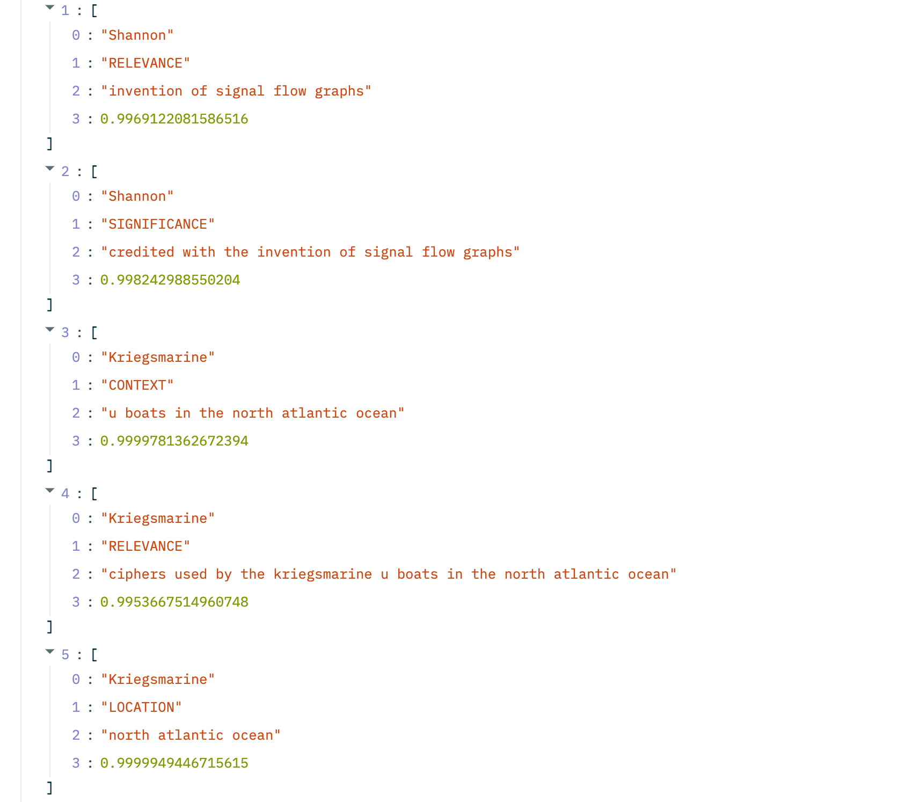

## NLP Knowledge Extraction
This repo contains a simple python implementation of bootstrapping a knowledge graph from scratch. The processing pipeline is detailed below...
- 1)    Core textual entities exctracted utilizing Spacy NER models
- 2)    BERT Question Answering module used to extact relational information of entities across pre-defined categories
- 3)    Exploration of clustering applications (Umap -> HDBscan, TF-IDF -> Kmeans)
    
## Streamlit Application
Basic streamlit app allowing user to add custom text and analyze knowledge extracted



## Setup Instructions
``` bash
docker build -t knowledge_extract . 
```

``` bash 
docker run -d knowledge_extract
```

``` bash 
streamlit run app.py 
```

